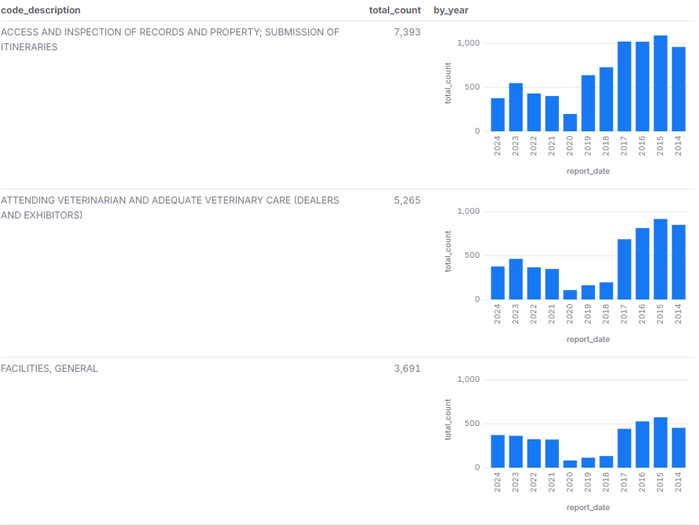
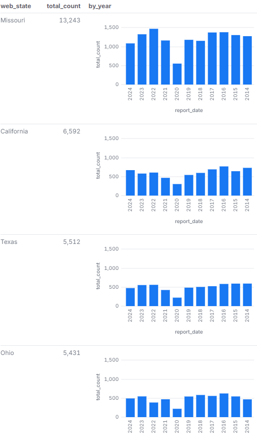
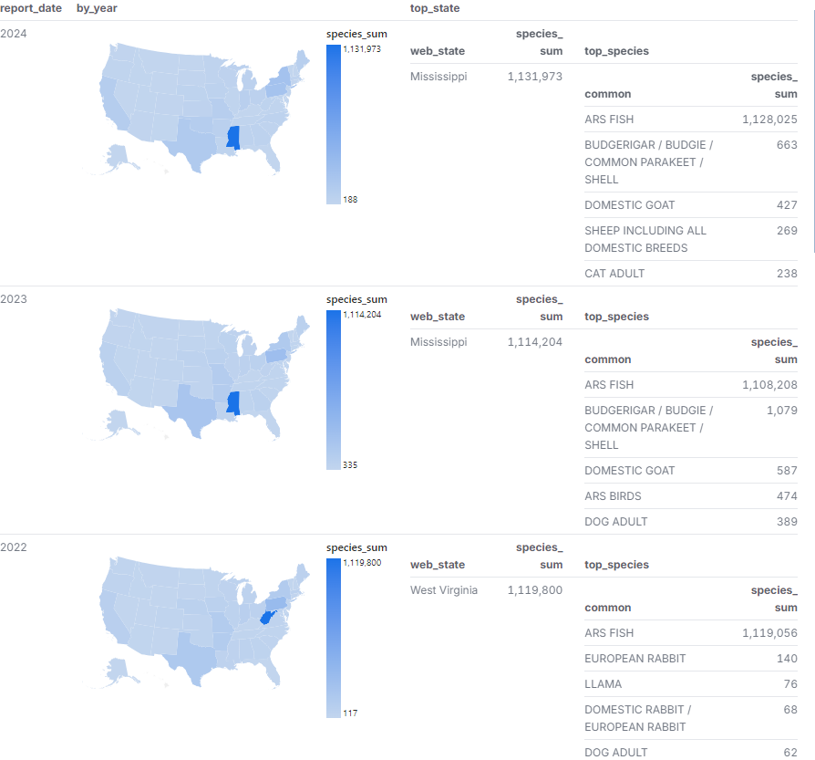
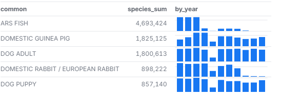
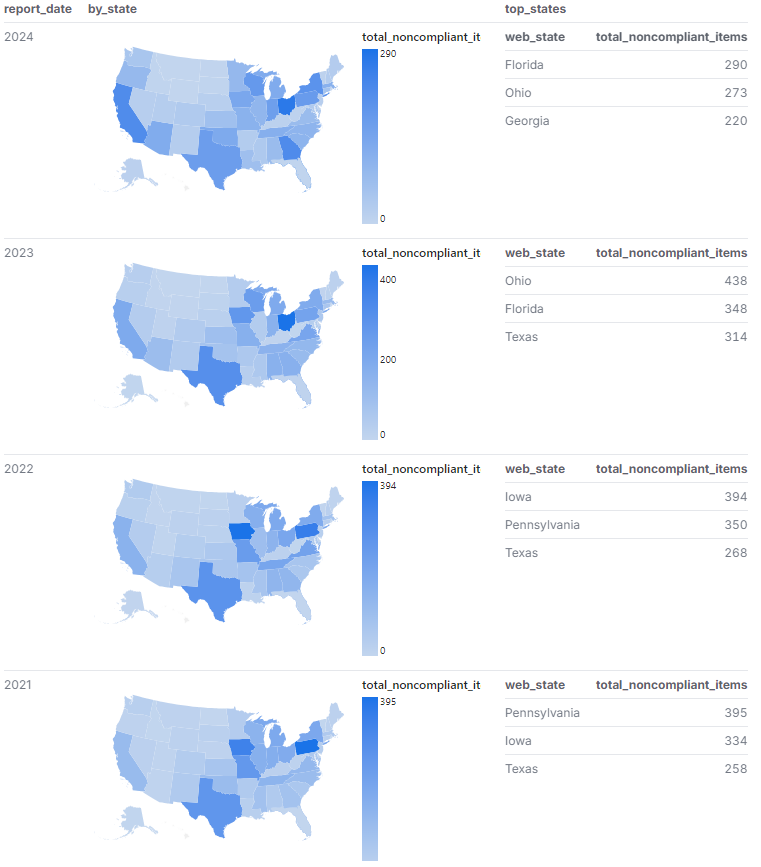
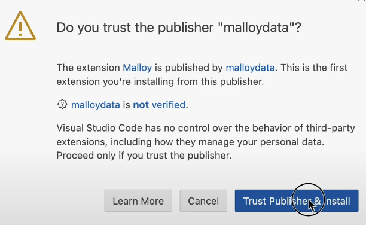

# Animal and Plant Health Inspection Services Data Analysis

This repository contains data obtained by the [Data Liberation Project](https://www.data-liberation-project.org/), via a [Freedom of Information Act request](https://www.data-liberation-project.org/datasets/aphis-inspection-reports/) to the USDA's Animal and Plant Health Inspection Service and pre-processed by the Data Liberation Project. 

## Summary of Findings

What did we find? Well let me tell you! With **images**! 

Here are some screenshots showcasing the analysis:

## Background and Motivation

The APHIS Inspection Reports dataset enhances transparency and accountability in animal welfare. While the USDA publishes inspection data, it lacks full accessibility and key details. The Data Liberation Project fills this gap by compiling and updating the data in an easy-to-use format.

## Code

This repository contains one Malloy code file:

- [`APHIS_LiberationProject_revised.malloynb`](APHIS_LiberationProject_revised.malloynb), performs the analysis piece of the data provided by the Data Liberation Project.

## Why Malloy?
[Malloy](https://malloydata.dev) is an open source semantic data language, and a compelling alternative to pandas, ggplot, and SQL!

## How see the analysis yourself
Are you logged into github? Just press the period key right now. This will load the web editor. Then install the malloy extension. See images below for reference:
| **Step**   | **Image Preview** |
|--------|-----------|
| `Step 1 - Press allow` |  |
| `Step 2 - Click the Blocks, search for Malloy, install` |  |
| `Step 3 - Click Trust` |  |
| `Step 4 - Click a .malloynb file` |  |
| `Step 5 - Press Run` |  |

## Licensing

The files provided directly via FOIA (see listing above) are, as government documents, now in the public domain. All other data files have been generated by Amber Mocalis for Gonzaga University Graduate School of Business as part of the MSBA-622-01 Data Science for Business (Spring 2025) course and are available under Creative Commons’ [CC BY-SA 4.0 license terms](https://creativecommons.org/licenses/by-sa/4.0/). This repository’s code is available under the [MIT License terms](https://opensource.org/license/mit/). 
